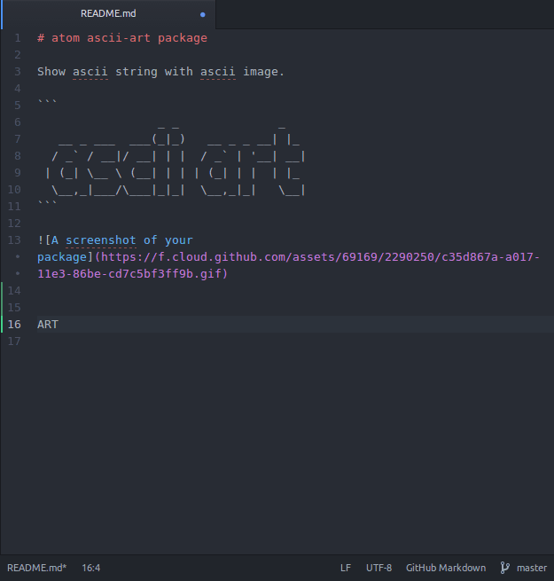

atom ascii-art package
===========================

Show ascii string with ascii image.

This is learn from atom official guid, you can find at [https://atom.io/docs/v1.1.0/hacking-atom-package-modifying-text](https://atom.io/docs/v1.1.0/hacking-atom-package-modifying-text).

```
                 _ _              _   
   __ _ ___  ___(_|_)   __ _ _ __| |_
  / _` / __|/ __| | |  / _` | '__| __|
 | (_| \__ \ (__| | | | (_| | |  | |_
  \__,_|___/\___|_|_|  \__,_|_|   \__|
```

# usage
* select the ascii string
* Ctrl + Alt + a


